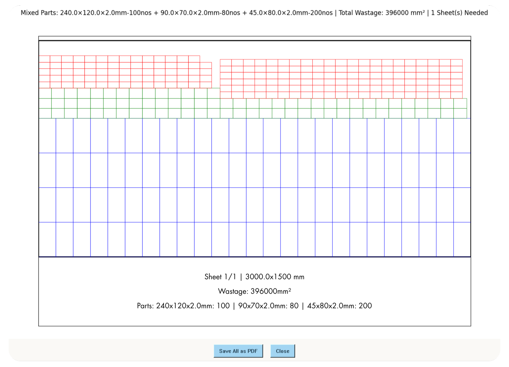

<p align="center">
  
</p>

<h1 align="center">Cut Smart</h1>

<p align="center">
  <strong>Intelligent Steel Plate Cutting Optimization & Layout Calculator</strong>
</p>

<p align="center">
  Built with Python, Tkinter, Matplotlib, and FPDF
</p>

---

## Overview

**SteelCut Optimizer** is a professional desktop application designed for steel fabrication shops, manufacturing facilities, and sheet metal workshops to optimize plate cutting layouts and minimize material waste.

Instead of manual calculations and guesswork, this tool automatically calculates the most efficient arrangement of parts on standard steel sheet sizes, significantly reducing material waste and saving costs.

The application supports both single-part and mixed-part optimization, providing visual layouts and exportable PDF reports for production planning.

<p align="center">
  
</p>

## Key Features

### Intelligent Layout Optimization
- **Mixed-part packing algorithm** - Automatically arranges different part sizes on the same sheet
- **Bottom-left packing strategy** - Maximizes sheet utilization with tight packing
- **Size-based prioritization** - Largest parts placed first for optimal efficiency
- **Multiple orientation support** - Automatically tests both orientations for each part

### Sheet Size Management
- **Customizable sheet sizes** - Add, edit, or delete standard sheet dimensions
- **Default size presets** - 3000×1500, 2500×1250, 2400×1200 mm
- **Persistent storage** - Sheet sizes saved automatically between sessions
- **Real-time validation** - Ensures only valid numeric sizes are saved

### Visual Layout Display
- **Interactive drawing window** - View layouts in full-screen mode
- **Grid and mixed layouts** - Visual representation of parts on each sheet
- **Multiple sheet pages** - Navigate through layouts page by page
- **Aspect ratio preserved** - Drawings maintain correct proportions

### PDF Export & Reporting
- **Professional PDF generation** - Save all layouts to print-ready PDF files
- **Multi-page PDF support** - Automatically handles 1-4 drawings per PDF page
- **Landscape A4 format** - Optimized for printing and review
- **Detailed annotations** - Includes sheet numbers, part counts, and wastage calculations

### Multi-Part Management
- **Dynamic part entry** - Add or remove multiple part sizes
- **Individual part calculations** - Optimize each part type separately
- **Mixed-part optimization** - Combine different parts on the same sheets
- **Quantity management** - Calculate exact number of sheets needed

### Wastage Analysis
- **Automatic wastage calculation** - Shows unused area per sheet and total
- **Optimization comparison** - Choose between smallest sheet fit or least wastage
- **Area tracking** - Visual feedback on material utilization

---

## System Architecture

```text
User Input (Parts & Sheets)
    │
    ▼
Select Mode (Single or Mixed)
    │
    ▼
Algorithm Processing
    ├─→ Single Part: Grid Packing
    └─→ Mixed Parts: Bottom-Left Packing
    │
    ▼
Layout Generation
    │
    ▼
Visual Display (Interactive Window)
    │
    ▼
PDF Export (Professional Report)
